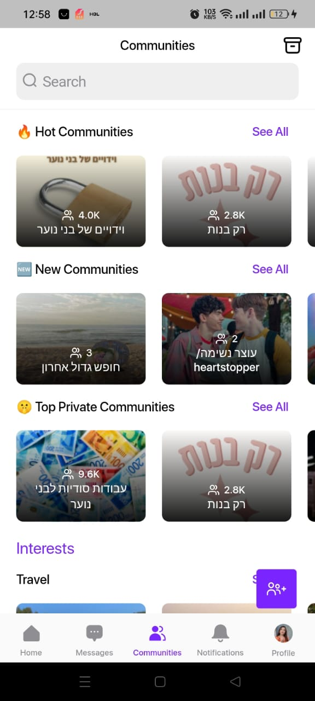
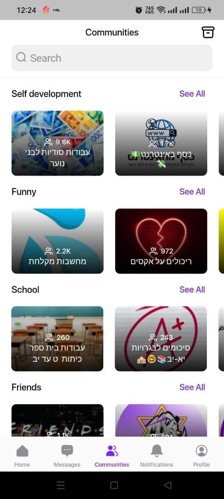

# Gaya 🌈

<p align="center">
  
</p>

<p align="center">
  <strong>A vibrant social networking mobile application built with Flutter</strong>
</p>

<p align="center">
  <a href="https://flutter.dev">
    
  </a>
  <a href="https://firebase.google.com">
    
  </a>
  <a href="https://nodejs.org">
    
  </a>
</p>

---

## 📱 About Gaya

Gaya is an innovative social networking platform that connects users through shared interests and passions. Utilizing advanced algorithms, it curates personalized content streams and facilitates seamless discovery of niche communities. The platform's intuitive interface encourages active participation and knowledge sharing across diverse topics.

Gaya redefines interest-based social networking. It creates a dynamic digital environment that fosters personal growth and collective learning while enabling meaningful connections among like-minded individuals.

### Key Features

- **Community Creation & Management** - Create, join, and moderate topic-based communities
- **Rich Content Feed** - Share posts with images, videos, and text with interactive features
- **Social Gamification** - Earn and give "crowns" to appreciate quality content
- **Real-time Messaging** - Instant communication with friends through ConnectyCube integration
- **User Interactions** - Like, comment, save, and report content
- **Push Notifications** - Stay updated with real-time alerts for interactions
- **Content Discovery** - Powerful search capabilities powered by Algolia
- **Multi-language Support** - Available in English and Hebrew with easy localization

## 📸 App Screenshots

<p align="center">
  
  
  
  
</p>

---

## 🛠️ Tech Stack

### Frontend
- **Framework**: [Flutter](https://flutter.dev/) (Dart)
- **State Management**: [GetX](https://pub.dev/packages/get)
- **UI Components**: Custom widgets with responsive design using [flutter_screenutil](https://pub.dev/packages/flutter_screenutil)

### Backend
- **Cloud Functions**: [Firebase Cloud Functions](https://firebase.google.com/products/functions) (Node.js)
- **Database**: [Cloud Firestore](https://firebase.google.com/products/firestore)
- **Authentication**: [Firebase Authentication](https://firebase.google.com/products/auth)
- **Storage**: [Firebase Storage](https://firebase.google.com/products/storage)
- **Search**: [Algolia](https://www.algolia.com/)
- **Real-time Messaging**: [ConnectyCube](https://connectycube.com/)
- **Push Notifications**: [Firebase Cloud Messaging](https://firebase.google.com/products/cloud-messaging)

### DevOps & Tools
- **Deployment**: Firebase Hosting
- **Over-the-Air Updates**: [Shorebird](https://shorebird.dev/)
- **Analytics**: Firebase Analytics
- **Crash Reporting**: Firebase Crashlytics
- **Performance Monitoring**: Firebase Performance

---

## 🚀 Getting Started

### Prerequisites
- [Flutter SDK](https://flutter.dev/docs/get-started/install) (3.0.0 or higher)
- [Node.js](https://nodejs.org/) (v16 LTS)
- [Firebase CLI](https://firebase.google.com/docs/cli)
- Android Studio / VS Code

### Installation

1. **Clone the repository**
   ```bash
   git clone https://github.com/your-username/gaya.git
   cd gaya
   ```

2. **Install Flutter dependencies**
   ```bash
   flutter pub get
   ```

3. **Install Firebase Functions dependencies**
   ```bash
   cd functions
   npm install
   cd ..
   ```

4. **Set up Firebase**
   - Create a Firebase project at [Firebase Console](https://console.firebase.google.com/)
   - Download `google-services.json` and place it in `android/app/src/dev/` and `android/app/src/prod/`
   - Configure Firebase for iOS if needed

5. **Configure environment variables**
   - Set up required API keys in Firebase Functions configuration

### Running the App

#### Development Mode
```bash
flutter run
```

#### Production Build
```bash
# Android
flutter build apk

# iOS
flutter build ios

# Web
flutter build web
```

### Running Firebase Functions Locally
```bash
cd functions
firebase emulators:start --only functions
```

### Deploying to Firebase
```bash
# Deploy functions only
firebase deploy --only functions

# Deploy entire project
firebase deploy
```

---

## 🧩 Core Architecture

### Frontend Structure
- **MVVM Pattern**: Using GetX for state management and separation of concerns
- **Repository Pattern**: Clean data layer abstraction
- **Modular Routing**: Organized navigation with GetX routing
- **Custom Widgets**: Reusable UI components for consistent design

### Backend Architecture
- **Event-Driven**: Firebase Functions triggered by Firestore events
- **Microservices**: Independent functions for different business logic
- **Scheduled Tasks**: Cron jobs for daily operations (crown distribution, score resets)
- **Security Rules**: Firestore security rules for data protection

---

## 🔐 Security & Privacy

- **Data Encryption**: AES encryption for sensitive data
- **Authentication**: Secure Firebase Authentication with multiple providers
- **Input Validation**: Server-side validation for all user inputs
- **Privacy Controls**: User-controlled visibility and blocking features

---

## 📊 Analytics & Monitoring

- **User Behavior Tracking**: Firebase Analytics for insights
- **Performance Monitoring**: Track app performance and bottlenecks
- **Crash Reporting**: Automatic crash reporting with stack traces
- **Business Metrics**: Custom events for engagement tracking

---

## 🌍 Localization

Gaya supports multiple languages with a simple JSON-based localization system:
- English (en_US)
- Hebrew (he_IL)

Adding new languages is as simple as creating a new JSON file in the [Assets/locales](Assets/locales) directory.

---

## 🧪 Testing

While the project currently has limited test coverage, we encourage adding:
- Unit tests for business logic
- Widget tests for UI components
- Integration tests for critical user flows

---

## 🤝 Contributing

We welcome contributions to Gaya! Here's how you can help:

1. Fork the repository
2. Create a feature branch
3. Commit your changes
4. Push to the branch
5. Open a pull request

Please ensure your code follows the existing style and includes appropriate tests.

---

## 📄 License

This project is proprietary and confidential. All rights reserved.

---

## 👥 Support

For support, feature requests, or bug reports, please [open an issue](https://github.com/your-username/gaya/issues) on GitHub.

---

## 🙏 Acknowledgements

- Thanks to all contributors who have helped build Gaya
- Firebase for providing a robust backend infrastructure
- The Flutter community for continuous support and amazing packages